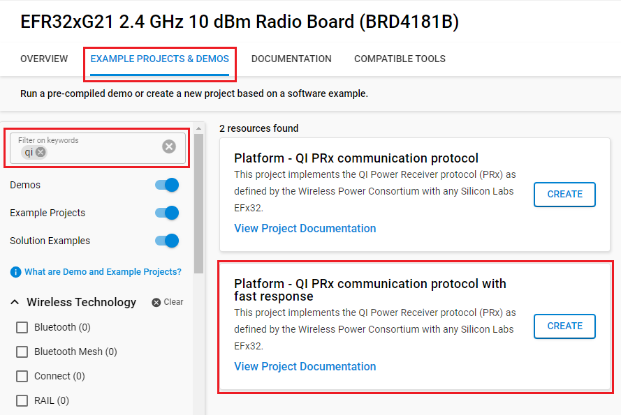

# Platform - QI PRx communication protocol #


## Summary ##

This project implements the QI Power Receiver protocol (PRx) as defined by the [**Wireless Power Consortium**](https://www.wirelesspowerconsortium.com/)
It allows a device based on any Silicon Labs EFx32 platform to implement the PRx protocol for both Base and Extended Power Profile Power Receivers (through Load Modulation) and enables building a device that can be wirelessly charged without the need of a separate QI charge controller.

The project complies with v1.3 of the specification which can be downloaded from [**here**](https://www.wirelesspowerconsortium.com/media/rwfpapjq/qi-v13-public.zip)

A special second project is available for implementation in e.g. a bootloader, when a very fast reaction time (e.g. after full power loss) is required, to guarantee meeting the timing requirements for maintaining the Power transmit charging power after the first appliance. (The Power transmitter needs feedback from the Power Receiver within 65ms after applying power, otherwise, it has to shut down power transmission again, see par Qi Specification Communication Protocol, par 4.2.3, ping timeout)

*Please note this project does not implement FSK decoding to receive PTx messages*

## Gecko SDK version ##

- v4.4.3

## Hardware Required ##

- A [Wireless Starter Kit Mainboard](https://www.silabs.com/development-tools/wireless/wireless-starter-kit-mainboard) with a [SLWRB4181B](https://www.silabs.com/development-tools/wireless/slwrb4181b-efr32xg21-wireless-gecko-radio-board) radio board

- Or a wireless starter kit [SLWSTK6023A](https://www.silabs.com/development-tools/wireless/efr32xg21-bluetooth-starter-kit)

For full testing, a QI-compliant Power Receiver hardware is used for which the QI specification zip file contains a pdf with Power Receiver Design Examples (for link see Summary). The output GPIO from this project needs to control the load modulation switch in these examples.

## Connections Required ##

GPIO controlling the Load Modulation in the Power Receiver circuitry: in the example the SPI_MOSI output of USART2 connected to PC00, on pin 4 of the EXP header of the SLWSTK4001 board. (See [UG429](https://www.silabs.com/documents/public/user-guides/ug429-brd4181b-user-guide.pdf) for details)

## Setup ##

To test this application, you can either create a project based on an example project or start with an empty example project.

### Create a project based on an example project ###

1. Make sure that this repository is added to [Preferences > Simplicity Studio > External Repos](https://docs.silabs.com/simplicity-studio-5-users-guide/latest/ss-5-users-guide-about-the-launcher/welcome-and-device-tabs).

2. From the Launcher Home, add your device to My Products, click on it, and click on the **EXAMPLE PROJECTS & DEMOS** tab. Find the example project filtering by **qi**.

3. Click the **Create** button on the **Platform - QI PRx communication protocol** example. Example project creation dialog pops up -> click **Finish** and Project should be generated.

    

4. Build and flash this example to the board.

**Note**:
If you need a very fast response (e.g. after POR), like in a bootloader, the `Platform - QI PRx communication protocol with fast response` should be used for testing. This project uses **fixed** PRx Qi messages in flash.



### Start with an empty example project ###

1. Create an **Empty C Project** project for your hardware using Simplicity Studio 5.

2. Copy all attached files in the *src* and *test/dynamic_at_runtime* folders into the project root folder (overwriting existing files).

3. Open the .slcp file. Select the SOFTWARE COMPONENTS tab and install the software components:

    - Uninstall the components:
          - [Services] → [Device Initialization] → [Automatic Device Initialization]
    - Install the components:
        - [Services] → [Device Initialization] → [Peripheral] → [Clocks]
        - [Services] → [Device Initialization] → [Peripheral] → [Digital Phase-Locked Loop (DPLL)]
        - [Services] → [Device Initialization] → [Peripheral] → [Energy Management Unit (EMU)]
        - [Services] → [Device Initialization] → [Peripheral] → [High Frequency Crystal Oscillator (HFXO)]
        - [Services] → [Device Initialization] → [Peripheral] → [Low Frequency RC Oscillator (LFRCO)]
        - [Services] → [Device Initialization] → [Peripheral] → [Nested Vector Interrupt Controller (NVIC)]
        - [Platform] → [Peripheral] → [PRS]
        - [Platform] → [Driver] → [SPI] → [SPIDRV] → default instance name: **exp** → Set SPI bitrate to 4000
        - [Services] → [IO Stream] → [IO Stream: USART] → default instance name: **vcom**
        - [Services] → [IO Stream] → [IO Stream: Retarget STDIO]
        - [Platform] → [Board] → [Board Control] → active "Enable Virtual COM UART"

4. Build and flash the project to your device.

## How It Works ##

For a QI-compliant Power Receiver (PRx) to communicate to a QI-compliant Power transmitter it needs to be able to send data through "Load Modulation" over the established Power Transfer coupling. The protocol scheme is defined in **Qi-v1.3-comms-physical.pdf**, part of the zip file referenced in the Summary.
The bit coding is differential bi-phasic (2kHz). To be able to generate this signal a 4kHz bitstream is generated which can be shifted out by SPI peripheral using LDMA to generate the bit coding per specification. The SPI peripheral is misused here and will only require its Tx signal (MOSI) and not the other SPI signals like Rx (MISO), clock, or chip select.


The byte encoding is an 11-bit asynchronous serial: Start bit, Data bits LSB first, parity and stop bit. The Data packet structure is also defined here consisting of a Preamble, Header, Message, and Checksum.

The actual timing and message content a PRx needs to send is defined in **Qi-v1.3-comms-protocol.pdf**, also part of the Zip package referenced in the Summary.
This example implements the messages needed for a BPP-PRx device (Base protocol class 0).

In this example, the SPI peripheral is used to shift out corresponding levels to create the required coding scheme. With SPI USART running from HFRCO, the required accuracy is accomplished by setting the SPI frequency to 4.000 kHz.

Here is the first message (PRx_SIG):


### Physical load modulation encoding ###

The `src/qi.c` file contains all functions related to bit (qi_add_to_spi_stream()), byte encoding (qi_code_byte()) as well as data packet (qi_create_packet()) encoding.
Multiple messages can be concatenated through repeat calls to the `qi_create_spi_stream_buffer()` function, including an option for pre-delay, to create a required pause between messages by just shifting out constant level to the load modulation GPIO.

### PRx communication protocol ###

The `test/dynamic_at_runtime/app_qidrv_prx.c` file defines the qi messages needed to comply with BPP-PRx (Base protocol class 0), which require a qi signal strength message, an identification message and a configuration message, followed by control error messages.
This example implements static default messages for this, to get the charging initialized and going. After this, the application can take over the charge control by modifying the control error messages (and potentially sending the PRx_EPT message).

### Sending the data ###

The `test/dynamic_at_runtime/app_qidrv_prx.c` file takes the generated SPI stream and sets up an LDMA transfer through the SPI/USART peripheral so the complete slow communication will run in hardware, without any further software intervention through a call to SPIDRV_MTransmit. Interrupts are informing the software when the transfer is finished so it can update/change messages if needed. In the meanwhile, the firmware can perform any other (application) function.

Here is the complete sequence after POR:


showing SIG ---- followed by IDENT ---- followed by CONFIG packet according to the specification.

### Performance ###

This example (sources in the `test/dynamic_at_runtime` file) will start the first data packet after approximately 47ms on the referenced board, which is well within the maximum allowed (70ms). Critical here is to NOT initialize the LFXO as this takes too long.


In case this application takes too long to start, e.g. caused by adding security features and/or additional bootloader operations, a solution is provided through the second project.

### Sub-project for a very fast reaction after POR (or on digital input) ###

The second test project is optimized for very fast sending of fixed qi messages after POR (or after triggering from a digital signal, GPIO).

With this, we achieve the start of the first data packet after 30ms:


The source `fixed_fast_after_por_gpio/main.c` uses the same message from the main project, but the messages are fixed and already encoded as SPI streams and declared "const" so they are located in flash. These arrays can be generated from the main project by setting the `#define QI_GENERATE_CODE 1` in the `qidrv_prx.c` file. The C code will be output through the UART:

```c
/******************************************************
* generated buffer for QI transmit over SPI, rev 0.1
******************************************************/
const uint8_t QI_init[] = {
0xAA, 0xAA, 0xAB, 0x4C, 0xCC, 0xD2, 0xAA, 0xAA,
0xB2, 0xAA, 0xAD, 0xFF, 0xFF, 0xFF, 0xFA, 0xAA,
0xAA, 0xB4, 0xCA, 0xB5, 0x2C, 0xD3, 0x2B, 0x55,
0x55, 0x52, 0xAA, 0xAA, 0xB5, 0x52, 0xAD, 0x2A,
0xAA, 0xAB, 0x55, 0x55, 0x52, 0xAA, 0xAA, 0xB3,
0x35, 0x4D, 0xFF, 0xFF, 0xFF, 0xFF, 0xFF, 0xFF,
0xFF, 0xAA, 0xAA, 0xAB, 0x4C, 0xB4, 0xD3, 0x4B,
0x32, 0xB3, 0x33, 0x35, 0x33, 0x33, 0x2B, 0x2C,
0xCB, 0x53, 0x33, 0x32, 0xB4, 0xD4, 0xCD
};

/******************************************************
* generated buffer for QI transmit over SPI, rev 0.1
******************************************************/
const uint8_t QI_control_error_PREDELAY[] = {
0xFF, 0xFF, 0xFF, 0xFF, 0xFF, 0xFF, 0xFF, 0xFF,
0xFF, 0xFF, 0xFF, 0xFF, 0xFF, 0xFF, 0xFF, 0xFF,
0xFF, 0xFF, 0xFF, 0xFF, 0xFF, 0xFF, 0xFF, 0xFF,
0xFF, 0xFF, 0xFF, 0xFF, 0xFF, 0xFF, 0xFF, 0xFF,
0xFF, 0xFF, 0xFF, 0xFF, 0xFF, 0xFF, 0xFF, 0xFF,
0xFF, 0xFF, 0xFF, 0xFF, 0xFF, 0xFF, 0xFF, 0xFF,
0xFF, 0xFF, 0xFF, 0xFF, 0xFF, 0xFF, 0xFF, 0xFF,
0xFF, 0xFF, 0xFF, 0xFF, 0xFF, 0xFF, 0xFF, 0xFF,
0xFF, 0xFF, 0xFF, 0xFF, 0xFF, 0xFF, 0xFF, 0xFF,
0xFF, 0xFF, 0xFF, 0xFF, 0xFF, 0xFF, 0xFF, 0xFF,
0xFF, 0xFF, 0xFF, 0xFF, 0xFF, 0xFF, 0xFF, 0xFF,
0xFF, 0xFF, 0xFF, 0xFF, 0xFF, 0xFF, 0xFF, 0xFF,
0xFF, 0xFF, 0xFF, 0xFF, 0xFF, 0xFF, 0xFF, 0xFF,
0xFF, 0xFF, 0xFF, 0xFF, 0xFF, 0xFF, 0xFF, 0xFF,
0xFF, 0xFF, 0xFF, 0xFF, 0xFF, 0xFF, 0xFF, 0xFF,
0xFF, 0xFF, 0xFF, 0xFF, 0xFF, 0xAA, 0xAA, 0xAB,
0x53, 0x33, 0x53, 0x33, 0x32, 0xB5, 0x33, 0x35
};
```

Back to the `fixed_fast_after_por_gpio/main.c` file:
Now the only thing required is to initialize the GPIO for triggering (InitPRSGpio()), initialize the USART2 for SPI Master operation (InitiUsart2()), and enable LDMA (InitLDMA()).
After the first base transfer (for POR), it is shown how to "arm" the same by GPIO.
The intend is to react fast enough, after Power is applied (device put on Qi charger), with QI load modulated messages to the charger to keep the Power Transfer (charging) going. This is done by connecting a signal from the power receive circuitry, indicating charging has started, to this GPIO.
The QI messages triggered by this GPIO run long enough until the application can take over and modulate/end power transfer when needed.
See this timing capture where button0 is used as a GPIO trigger:


## Special Notes ##

The example does not implement all QI exceptions, like a restart of the Power transmitter requiring a restart of the PRx sequence. However, this is an easy addition based on a digital input (GPIO) indicating Power is present or not and reacting on this signal by an interrupt.
