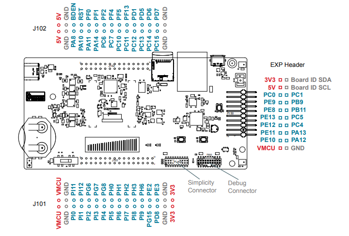
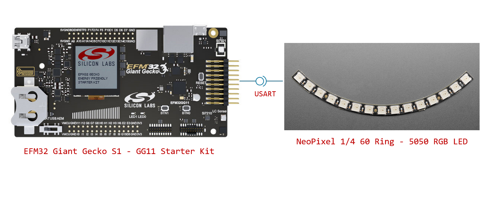
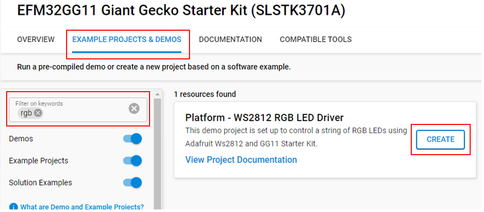
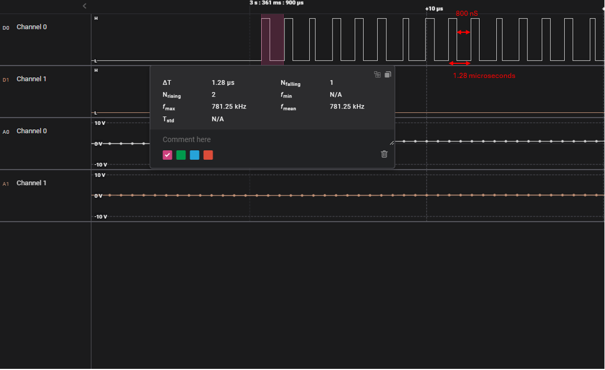

# Platform - WS2812 RGB LED Driver #

## Overview ##

This driver controls WS2812 RGB LEDs. These LEDs use a fast asynchronous single-wire serial protocol and are daisy-chainable.

The protocol runs around 800kHz which is too fast to efficiently bit-bang without a lot of optimization and overhead. Generally, drivers for this device are written in assembly. This driver instead uses the USART peripheral in an unconventional way to accomplish this with minimal overhead. This also allows the peripheral to transmit using the LDMA instead of a blocking mode like other drivers.

This driver can support any number of LEDs, however, if powering the LED string using the DevKit, the number of LEDs will be limited by the current requirements of the LED string. 

## Gecko SDK version ##

GSDK v4.4.3

## Hardware Required ##

- [EFM32 Giant Gecko S1 - GG11 Starter Kit](https://www.silabs.com/development-tools/mcu/32-bit/efm32gg11-starter-kit?tab=overview)
- [String of WS2812 LEDs](https://www.adafruit.com/product/4684). These come in many forms but Adafruit's Neopixel line is most common.

Note: This example uses [the NeoPixel 1/4 60 Ring - 5050 RGB LED](https://www.adafruit.com/product/1768) with 15 LEDs in the LED string.

## Connections Required ##

- The LED string needs to be powered. This can be done using an external 3.3v power source or using the VMCU and GND pins on the EXP Header of the SLSTK3701A board. If using an external power source, the grounds should be tied together.

- The default serial output of this driver is PE10 which is located on the EXP Header. Connect the DIN pin of NeoPixel to the MOSI (PE10) pin of the EFM32GG11 Start Kit.

## Setup ##

To test this application, you can either create a project based on an example project or start with an empty example project.

### Create a project based on an example project ###

1. Make sure that this repository is added to [Preferences > Simplicity Studio > External Repos](https://docs.silabs.com/simplicity-studio-5-users-guide/latest/ss-5-users-guide-about-the-launcher/welcome-and-device-tabs).

2. From the Launcher Home, add your board to My Products, click on it, and click on the **EXAMPLE PROJECTS & DEMOS** tab. Find the example project filtering by **'rgb'**.

3. Click the **Create** button on the **Platform - RGB LED (Adafruit WS2812)** example. Example project creation dialog pops up -> click **Finish** and Project should be generated.

    

4. Build and flash this example to the board.

### Start with an empty example project ###

1. Create an **Empty C Project** project for your hardware using Simplicity Studio 5.

2. Replace all source and header files in the project root folder with all source and header files in the `src` and `inc` folder.

3. Open the .slcp file. Select the SOFTWARE COMPONENTS tab and install the software components:

    - [Platform] → [Peripheral] → [GPIO]
    - [Platform] → [Peripheral] → [LDMA]
    - [Platform] → [Peripheral] → [USART]
    - [Platform] → [Peripheral] → [LETIMER]

4. Build and flash the project to your device.

## How It Works ##

The datasheet can be found here: https://cdn-shop.adafruit.com/datasheets/WS2812B.pdf.

According to the WS2812 datasheet, the protocol runs at 800kHz.

- A '1' bit is created by a pulse that starts high, ends low and has a duty cycle of 64% (.8uS HIGH and 0.4uS LOW).

- A '0' bit is created by a pulse that starts high, ends low and has a duty cycle of 32% (.4uS HIGH and 0.85uS LOW). The tolerance on every edge is 150nS.

By using a frequency of 3 x 800 kHz = 2.4MHz, 3 bits at 2.4MHz represent each bit at 800KHz. Each series of 3 bits begins with a '1' bit and ends with a '0' bit. The middle bit is modified to represent the color bit. If the middle bit is set to '1', the duty cycle will be 66% (0.833uS HIGH and 0.416uS LOW). If the middle bit is set to '0' the duty cycle will be 33% (0.416uS HIGH and 0.833uS LOW). The duty cycle for a bit is ~1.28 microseconds. These HIGH and LOW times are within 40nS of the specifications from the datasheet and are well within the 150nS allowed tolerance for the protocol.

This driver uses the USART peripheral with the CLK, CS and RX disabled as only the TX pin is needed.

## Testing ##

1. The user configures the NUMBER_OF_LEDS macro to set the number of LEDs in the LED string that you control. The NUMBER_OF_LEDS macro defaults to 10.

2. By default, the LDMA uses channel 1. The USART uses USART0 and has PE10 (LOC0) as the serial output. The user can redefine both the LDMA and UART.

3. The application should call init_ws2812_driver(), which will initialize the USART as well as the LDMA.

4. To change the lights the user should call set_color_buffer(). This function takes a uint8_t array as its parameter. The array should be sequences of 8-bit HEX color values corresponding to the desired RGB colors. The bytes should be arranged in sequences of Green, Red then Blue. Therefore 3 bytes total for every RGB LED.

5. For example: if there are 10 LEDs in the string, the array should be 30 bytes long (10 sequences of 3 HEX values per LED). The LEDs are addressed sequentially starting with the first LED in the daisy chain.

6. This application is set up to control a string of 10 RGB LEDs. There is a sleep timer that is set up to update the RGB LEDs every 0.5 seconds. The colors are randomly chosen. To improve the usability and add abstraction there is a 'colors' library which includes a struct to hold the 8-bit RGB values for a single LED as well as a method for proportionally reducing the brightness intensity of an LED. When the device is waiting for the next update, it goes into EM2 sleep.