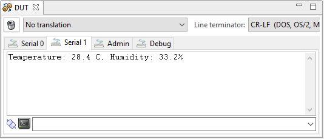
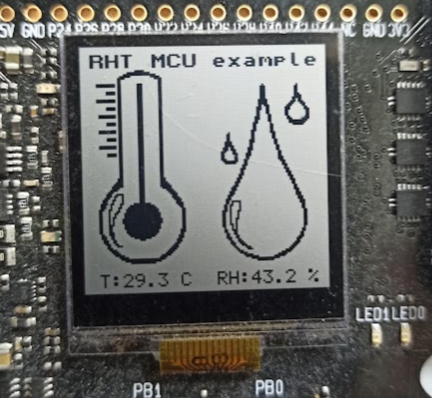

# RHT Si7021 bare-metal example #

## Summary ##

This example's purpose is to showcase the Wireless Starter Kit (WSTK) Si7021 RHT sensor and implement it in your project using the GSDK software components.

## Gecko SDK version ##

v4.0.x
> This example was tested on this version, porting to other GSDK versions should be similar.

## Hardware Required ##

- 1x BRD4001A - WSTK
- 1x BRD4182A rev B03 radio board (EFR32MG22)

> Use of other radio boards or EFM32/EFR32 development kits is possible. Modifications are required in terms of GPIO selection. Certain features (such as the LCD screen feedback) won't be implemented or could require further changes when using different kits depending on the available peripherals. **Always refer to your development kit/radio board user guide for details**.

## Setup ##

If using this project with the WSTK + BRD4182A, is enough to import the project through the provided [.sls](SimplicityStudio/rht_si7021_baremetal.sls) file into Simplicity Studio v5 (for details, see the [following site][SSV5_IMPORT_LINK]), build the project, and flash it to your board.

If you want to create the project from scratch for a different radio board or kit, refer to the following [community KBA][RHT_SENSOR_MCU_KBA_LINK], specifically  sections "*1. Creating the projects*" and "*2. Configuring the project*"; for an explanation of which software components to use and required configurations. You'll also need to copy the provided source files in the [src](src/), [inc](inc/) and [test](test/) folders to your project.

## How It Works ##

The application communicates with the WSTK Si7021 RHT sensor and requests the RH and temperature data. This data can then be accessed/displayed in 3 different ways:

1. Checking the values of the variables directly through a **debug session**.
2. Through the **VCOM port**: Using the Simplicity Studio v5 CLI console (serial 1) or any other 3rd party software that can connect to the WSTK COM port.
   - To enable this function set the symbol `VCOM_PRINT_EXTENSION` to 1 in the `app.c` file.
   
3. Through the **LCD screen** of the WSTK.
   - To enable this function set the symbol `LCD_SCREEN_EXTENSION` to 1 in the `app.c` file.
   

Data is updated every ~1 second. This time is configurable through the symbol `INTER_MEASUREMENT_DELAY` in the `app.c` file.

## .sls Projects Used ##

[rht_si7021_baremetal.sls](SimplicityStudio/rht_si7021_baremetal.sls)

## How to Port to Another Part ##

Open the "Project Properties" and navigate to the "C/C++ Build -> Board/Part/SDK" item. Select the new board or part to target and "Apply" the changes. ***Note:** there may be dependencies that need to be solved when changing the target architecture.*

## Special Notes ##

For in-depth details about the project structure, configuration, and testing, please refer to the following Community Knowledge-Based Articles:

- [Evaluating the Si7021 RHT sensor - Main KBA][RHT_SENSOR_MAIN_KBA_LINK]
- [Evaluating the Si7021 RHT sensor - Stackless MCU example][RHT_SENSOR_MCU_KBA_LINK]

[SSV5_IMPORT_LINK]:https://docs.silabs.com/simplicity-studio-5-users-guide/latest/ss-5-users-guide-about-the-simplicity-ide/import-and-export
[RHT_SENSOR_MAIN_KBA_LINK]:https://community.silabs.com/s/article/Evaluating-the-Si7021-RHT-sensor-Main-KBA?language=en_US
[RHT_SENSOR_MCU_KBA_LINK]:https://community.silabs.com/s/article/Evaluating-the-Si7021-RHT-sensor-Stackless-MCU-example-Part-1?language=en_US
