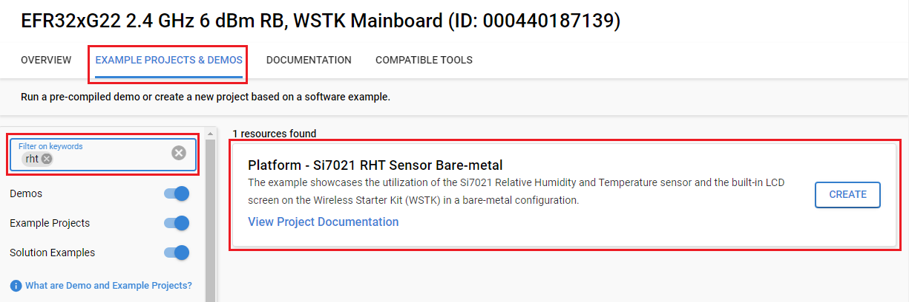

# Platform - Si7021 RHT Sensor Bare-metal #

## Overview ##

The example showcases the utilization of the Si7021 Relative Humidity and Temperature sensor and the built-in LCD screen on the Wireless Starter Kit (WSTK) in a bare-metal configuration.

## Gecko SDK Suite version ##

- GSDK v4.4.3

## Hardware Required ##

- [EFR32xG22 Wireless Gecko Starter Kit (BRD4182A)](https://www.silabs.com/development-tools/wireless/efr32xg22-wireless-starter-kit?tab=overview)

**Note:**

   - The use of other radio boards, EFM32 or EFR32 development kits is possible. Modifications are required in terms of GPIO selection. Certain features (such as the LCD screen) will not be implemented or could require further changes when using different kits depending on the available peripherals. You should refer to the development kit or radio board user guide for details.

   - Tested boards for working with this example:

      | Board ID | Description  |
      | ---------------------- | ------ |
      | BRD4182A | [EFR32xG22 Wireless Gecko Starter Kit](https://www.silabs.com/development-tools/wireless/efr32xg22-wireless-starter-kit?tab=overview)|
      | BRD4161A | [EFR32MG12 2.4GHz 19dBm Radio Board](https://www.silabs.com/development-tools/wireless/zigbee/slwrb4161a-efr32mg12-radio-board?tab=overview)|
      | BRD4187C | [EFR32xG24 Wireless 2.4 GHz +20 dBm Radio Board](https://www.silabs.com/development-tools/wireless/xg24-rb4187c-efr32xg24-wireless-gecko-radio-board?tab=overview)|
      | BRD4104A | [EFR32BG13 2.4 GHz 10 dBm Radio Board](https://www.silabs.com/wireless/bluetooth/efr32bg13-series-1-socs)|
      | BRD4158A | [EFR32MG13 2400/915 MHz 19 dBm Radio Board](https://www.silabs.com/wireless/zigbee/efr32mg13-series-1-socs/device.efr32mg13p732f512gm48?tab=specs)|
      | BRD4257B | [EFR32FG14 2400/868 MHz 13 dBm Radio Board](https://www.silabs.com/wireless/proprietary/efr32fg14-series-1-sub-ghz-2-4-ghz-socs)|

## Connections Required ##

Connect the board via the connector cable to your PC to flash the example.

## Setup ##

To test this application, you can either create a project based on an example project or start with an "Empty C Project" project based on your hardware.

### Create a project based on an example project ###

1. From the Launcher Home, add your product name to My Products, click on it, and click on the **EXAMPLE PROJECTS & DEMOS** tab. Find the example project filtering by "rht".

2. Click the **Create** button on **Platform - Si7021 RHT Sensor Bare-metal** example. Example project creation dialog pops up -> click Create and Finish and the project should be generated.

3. Build and flash this example to the board.

### Start with an "Empty C Project" project ###

1. Create an **Empty C Project** project for your hardware using Simplicity Studio 5.

2. Copy all files in the `inc` and `src` folders into the project root folder (overwriting the existing file).

3. Install the software components:

    3.1 Open the .slcp file in the project

    3.2 Select the SOFTWARE COMPONENTS tab

    3.3 Install the following components:

      - If your board is one of the following boards: `BRD4182A`, `BRD4161A`, `BRD4104A`, `BRD4257B` or `BRD4158A`

        - [Services] → [IO Stream] → [Driver] → [IO Stream: USART] → default instance name: vcom
    
      - If your board is `BRD4161A`.

        - [Services] → [IO Stream] → [Driver] → [IO Stream: LEUART] → default instance name: vcom

      - If your board is `BRD4187C`.

        - [Services] → [IO Stream] → [Driver] → [IO Stream: EUSART] → default instance name: vcom
    
      - [Platform] → [Board Drivers] → [Memory LCD] → [Peripheral Driver] → [Memory LCD with usart SPI driver]

      - [Application] → [Utility] → [Log]
  
      - [Platform] → [Board Drivers] → [Si70xx - Temperature/Humidity Sensor]

      - [Platform] → [Driver] → [GLIB driver for Memory LCD]

      - [Platform] → [Driver] → [GLIB Graphics Library]
  
      - [Platform] → [Board]  → [Board Control]: configure as the picture below:
      

4. Install **printf float**

    - Open Properties of the project.

    - Select C/C++ Build → Settings → Tool Settings → GNU ARM C Linker → General. Check Printf float.
    

5. Build and flash the project to your board.

## How It Works ##

The application reads data from the Si7021 Relative Humidity and Temperature every second. The data includes relative humidity and temperature. Data can be visualized in three ways below:

1. Checking the values of the variables directly through the **Simplicity Debugger**.

2. Through the **VCOM Port**: You can launch Console, which is integrated into Simplicity Studio or you can use a third-party terminal tool like Tera Term to receive the data. Data is coming from the UART COM port. To enable this function set the symbol `VCOM_PRINT_EXTENSION` to `1` in the `app.c` file. A screenshot of the console output is shown in the figure below.

3. Through the **built-in LCD screen** of the WSTK: To enable this function, set the symbol `LCD_SCREEN_EXTENSION` to `1` in the `app.c` file. The screen shows a temperature icon, a humidity icon, and the values right below each one.

The interval time is configurable through the symbol `INTER_MEASUREMENT_DELAY` in the `app.c` file.
