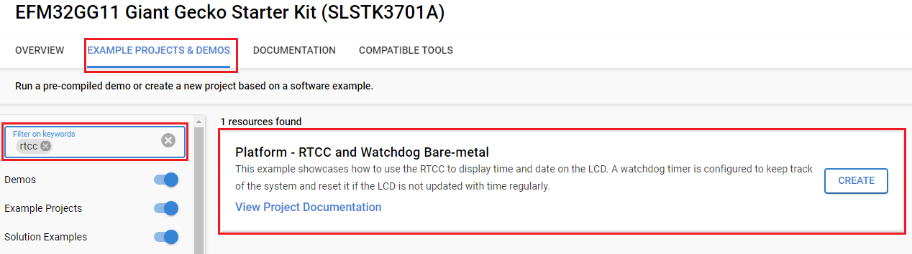
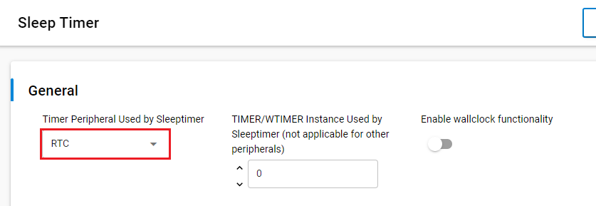
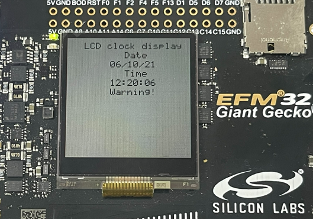
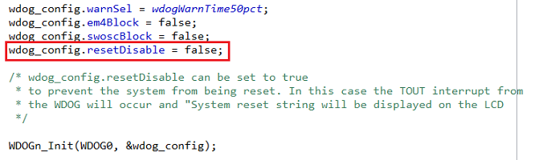
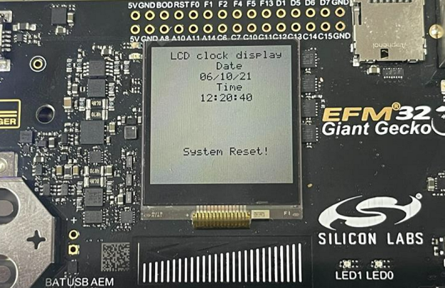

# Platform - RTCC and Watchdog Bare-metal #

## Overview ##

This example showcases how to use the Real Time Clock and Calendar (RTCC) to display time and date on the built-in LCD. A watchdog timer is a timer that monitors microcontroller programs to see if they are out of control or have stopped operating. It acts as a “watchdog” watching over MCU operation. In this project, a watchdog timer is configured to keep track of the system and reset it if the LCD is not updated with time regularly.

## Gecko SDK Suite version ##

- GSDK v4.4.3 

## Hardware Required ##

- [EFM32GG11 Giant Gecko Starter Kit - SLSTK3701A](https://www.silabs.com/development-tools/mcu/32-bit/efm32gg11-starter-kit?tab=overview)

**Note:**

Tested boards for working with this example:

| Board ID | Description  |
| ---------------------- | ------ |
| BRD2204A | [EFM32GG11 Giant Gecko Starter Kit](https://www.silabs.com/development-tools/mcu/32-bit/efm32gg11-starter-kit?tab=overview)|

## Connections Required ##

Connect the board via the connector cable to your PC to flash the example.

## Setup ##

To test this application, you can either create a project based on an example project or start with an "Empty C Project" project based on your hardware.

### Create a project based on an example project ###

1. Make sure that this repository is added to [Preferences > Simplicity Studio > External Repos](https://docs.silabs.com/simplicity-studio-5-users-guide/latest/ss-5-users-guide-about-the-launcher/welcome-and-device-tabs).

2. From the Launcher Home, add your product name to My Products, click on it, and click on the **EXAMPLE PROJECTS & DEMOS** tab. Find the example project filtering by "rtcc".

3. Click the **Create** button on **Platform - RTCC and Watchdog Bare-metal** example. Example project creation dialog pops up -> click Create and Finish and the project should be generated.

1. Build and flash this example to the board.

### Start with an "Empty C Project" project ###

1. Create an **Empty C Project** project for your hardware using Simplicity Studio 5.

2. Copy all files in the `inc` and `src` folders into the project root folder (overwriting the existing file).

3. Install the software components:

    3.1. Open the .slcp file in the project

    3.2. Select the SOFTWARE COMPONENTS tab

    3.3. Install the following components:

    - [Platform] → [Peripheral] → [RTC]

    - [Platform] → [Peripheral] → [RTCC]

    - [Platform] → [Peripheral] → [WDOG]

    - [Platform] → [Board Drivers] → [Memory LCD] → [Peripheral Driver] → [Memory LCD with usart SPI driver] 

    - [Platform] → [Driver] → [GLIB driver for Memory LCD]

    - [Platform] → [Driver] → [GLIB Graphics Library]

    - [Services] → [Power Manager] → [Power Manager]
  
    - [Services] → [Timers] → [Sleep Timer]: configure the timer used by the sleep timer to RTC as below:
	  

4. Build and flash the project to your board.

## How It Works ##

The RTCC is configured to use the 32768Hz LFXO Clock and generate an interrupt every second. The LCD is updated every second as a result of this interruption. The watchdog timer is configured to overflow in 8 seconds.

If the LCD is updated at least 7 times in the 8 seconds, the watchdog timer will be cleared. Otherwise, the system will be reset. Additionally, a warning is also displayed on the LCD when the watchdog timer has reached 75% of the limitations.

To test the project, simply run the project and observe the output on the LCD. The date and time should be displayed according to the configuration. If BTN0 is pressed, then the WDOG timer should overflow and the system will be reset.  

To disable system reset when the WDOG timer overflows, set the `resetDisable` variable in ` WDOG_Init_TypeDef` struct to `true`. This variable is `wdog_config` in the `wdog.c` file. 

This will trigger the TOUT interrupt on WDOG overflow and print "System Reset" on the LCD.

