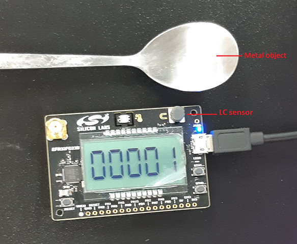
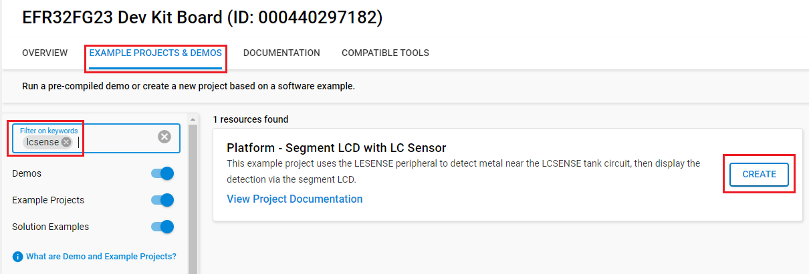

# Platform - Segment LCD with LC Sensor

## Summary

This project shows how to use the LESENSE peripheral to detect metal near the LCSENSE tank circuit, then display the detection via the segment LCD.
    

## Gecko SDK version

- v4.4.3

## Hardware Required

- [EFR32FG23 868-915 MHz +14 dBm Dev Kit](https://www.silabs.com/development-tools/wireless/proprietary/efr32fg23-868-915-mhz-14-dbm-dev-kit)
- [EFM32PG28 Pro Kit](https://www.silabs.com/development-tools/mcu/32-bit/efm32pg28-pro-kit)

## Connections Required

- Connect the Kit to the PC through a micro USB cable.

## Setup

To test this application, you can either create a project based on an example project or start with an empty example project.

### Create a project based on an example project

1. Make sure that this repository is added to [Preferences > Simplicity Studio > External Repos](https://docs.silabs.com/simplicity-studio-5-users-guide/latest/ss-5-users-guide-about-the-launcher/welcome-and-device-tabs).

2. From the Launcher Home, add your board (BRD2600A or BRD2506A) to My Products, click on it, and click on the **EXAMPLE PROJECTS & DEMOS** tab. Find the example project filtering by **lcsense**.

3. Click the **Create** button on the **Platform - Segment LCD with LC Sensor** example. Example project creation dialog pops up -> click **Finish** and Project should be generated.

    

4. Build and flash this example to the board.

### Start with an empty example project

1. Create an **Empty C Project** project for your hardware using Simplicity Studio 5.

2. Copy all attached files in the **inc** and **src** folders into the project root folder (overwriting existing files).

3. Open the .slcp file. Select the SOFTWARE COMPONENTS tab and install the software components:

    - [Platform] → [Peripheral] → [ACMP]
    - [Platform] → [Peripheral] → [LCD]
    - [Platform] → [Peripheral] → [LESENSE]
    - [Platform] → [Peripheral] → [PCNT]
    - [Platform] → [Peripheral] → [PRS]
    - [Platform] → [Peripheral] → [VDAC]
    - [Services] → [Power Manager] → [Power Manager]

4. Build and flash the project to your device.

## How It Works

The LESENSE peripheral is configured to scan the sensor periodically. The sensor is routed to PB3 on BRD2600A and PB7 on BRD2506A, which is configured as LESENSE channel 0. The pin is also routed to the ACMP, and the ACMP is controlled by the LESENSE to compare the damping waveform with a divided voltage of about 1.7 V. The VDAC is used to shorten the two ends of the tank circuit. During the excitation stage, the measured pin is pulled low to charge the circuit. The number of ACMP pulses is then compared with a threshold to determine if the metal is near. When metal is near the sensor, the waveform damps faster, which makes the number of ACMP pulses less than in the case where no metal is near. When this change in count occurs, the LESENSE decoder will update its state and signal the pulse counter peripheral (PCNT). Then the pulse counter will trigger an interrupt when its counter overflows to update the segment LCD.

## Testing

To test this application, follow the below steps:

1. Place a metal object near (right above or touching) the LC sensor
2. Observe the segment LCD counter increment by 1
3. Remove the metal object, and then place the metal object near the LC sensor again
4. Observe the segment LCD counter increment by 1
5. Press the button0, observe the segment LCD display reset to 0
6. Repeat STEP3 five times and observe the segment LCD increment by 1

