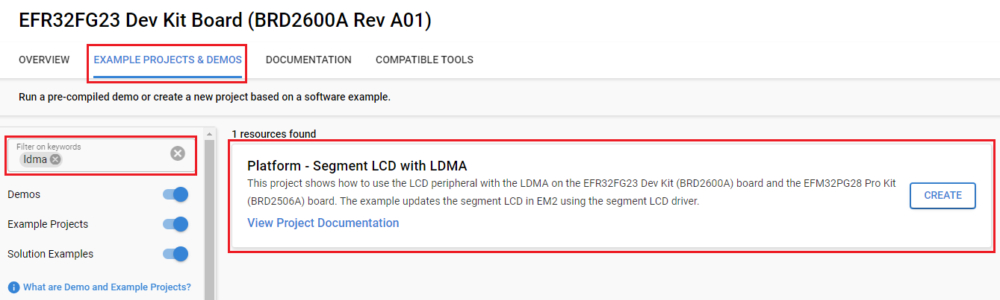

# Platform - Segment LCD with LDMA #

## Overview ##

This project shows how to use the LCD peripheral with the LDMA on the EFR32FG23 Dev Kit (BRD2600A) board and the EFM32PG28 Pro Kit (BRD2506A) board. The example updates the segment LCD in EM2 using the segment LCD driver.

## Gecko SDK Suite version ##

- GSDK v4.4.3

## Hardware Required ##

- [Silicon Labs EFR32FG23 Dev Kit Board - BRD2600A ](https://www.silabs.com/development-tools/wireless/proprietary/efr32fg23-868-915-mhz-14-dbm-dev-kit?tab=overview)

- [Silicon Labs EFM32PG28 Pro Kit Board - BRD2506A](https://www.silabs.com/development-tools/mcu/32-bit/efm32pg28-pro-kit?tab=overview)

**NOTE:**

Tested boards for working with this example:

| Board ID | Description  |
| ---------------------- | ------ |
| BRD2600A | [Silicon Labs EFR32FG23 Dev Kit ](https://www.silabs.com/development-tools/wireless/proprietary/efr32fg23-868-915-mhz-14-dbm-dev-kit?tab=overview)    |
| BRD2506A | [Silicon Labs EFM32PG28 Pro Kit Board](https://www.silabs.com/development-tools/mcu/32-bit/efm32pg28-pro-kit?tab=overview)  |

## Hardware Connection ##

Connect the board via a micro-USB cable to your PC to flash the example.

## Setup ##

To test this application, you can either create a project based on an example project or start with an "Empty C Project" project based on your hardware.

### Create a project based on an example project ###

1. Make sure that this repository is added to [Preferences > Simplicity Studio > External Repos](https://docs.silabs.com/simplicity-studio-5-users-guide/latest/ss-5-users-guide-about-the-launcher/welcome-and-device-tabs).

2. From the Launcher Home, add your hardware to **My Products**, click on it, and click on the **EXAMPLE PROJECTS & DEMOS** tab. Find the example project filtering by "ldma".
  
3. Click the **Create** button on the **Platform - Segment LCD with LDMA** example. Example project creation dialog pops up -> click Create and Finish and Project should be generated.

4. Build and flash this example to the board.

### Start with an empty example project ###

1. Create an "Empty C Project" for the "EFR32FG23 Dev Kit board" or "EFM32PG28 Pro Kit board" using Simplicity Studio v5. Use the default project settings.

2. Copy the file `src/app_fg23.c` (for EFR32FG23 Dev Kit board) or `src/app_pg28.c` (for EFM32PG28 Pro Kit board) into the project folder (replace the existing `app.c` file).

3. Install the software components:

    - Open the .slcp file in the project.

    - Select the SOFTWARE COMPONENTS tab.

    - Install the following components:

        - [Platform] → [Board Drivers] → [Segment LCD]

        - [Platform] → [Peripheral] → [LDMA]

4. Build and flash this example to the board.

## How It Works ##

The LCD peripheral is configured to send a DMA request on an LCD Frame Counter event every second. The LDMA uses looping linked-list descriptors to update the LCD_SEGn registers. A display buffer contains the desired values to write to the LCD_SEGn registers.

The LCD_SEGn registers are clocked by a different clock domain and must be synchronized in order for the register writes to take effect. The LCD peripheral is configured so the LCD_SEGn registers are automatically synced once the LCD_SEG3 register is written to.

The first descriptor sets the starting address of the display buffer as the base source address of the LDMA channel. The second descriptor is loaded and waits for a DMA request.

The second descriptor transfers the contents in the display buffer to the LCD_SEGn registers. This descriptor loops 9 times, and then the third descriptor is loaded.

The third descriptor updates the loop counter back to 9 and then loads the first descriptor.

You can observe the change on the LCD as follows: `00000` -> `11111` -> `22222` -> `...` -> `99999` -> `00000` after every second. 

This example does not require processor intervention once entering EM2.
