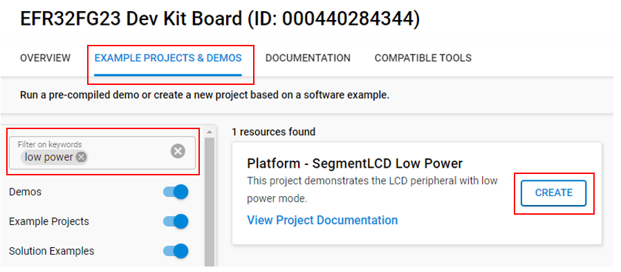

# Platform - SegmentLCD Low Power #

## Overview ##

This project demonstrates the LCD peripheral on FG23 (BRD2600A) and PG28 (BRD2506A). The LCD peripheral is configured for low power consumption with all segments enabled.

## Gecko SDK version ##

GSDK v4.4.3

## Hardware Required ##

* [Silicon Labs EFR32FG23 Dev Kit Board (BRD2600A)](https://www.silabs.com/development-tools/wireless/proprietary/efr32fg23-868-915-mhz-14-dbm-dev-kit?tab=overview)
* Or [Silicon Labs EFM32PG28 Pro Kit Board (BRD2506A)](https://www.silabs.com/development-tools/mcu/32-bit/efm32pg28-pro-kit?tab=overview)

## Connections Required ##

Connect the board via a micro-USB cable to your PC to flash the example.

To take current measurements:

1. Disconnect the board from the PC.

2. Connect the board to the current sensing supply to VMCU and GND.

## Setup ##

To test this application, you can either create a project based on an example project or start with an empty example project.

### Create a project based on an example project ###

1. Make sure that this repository is added to [Preferences > Simplicity Studio > External Repos](https://docs.silabs.com/simplicity-studio-5-users-guide/latest/ss-5-users-guide-about-the-launcher/welcome-and-device-tabs).

2. From the Launcher Home, add your board to My Products, click on it, and click on the **EXAMPLE PROJECTS & DEMOS** tab. Find the example project filtering by **'low power'**.

3. Click the **Create** button on the **Platform - SegmentLCD Low Power** example. Example project creation dialog pops up -> click **Finish** and Project should be generated.

    

4. Build and flash this example to the board.

### Start with an empty example project ###

1. Create an **Empty C Project** project for your hardware using Simplicity Studio 5.

2. Replace the `app.c` file in the project root folder with the provided `app.c` (located in the src folder) according to your board.

3. Open the .slcp file. Select the SOFTWARE COMPONENTS tab and install the software components:

    - [Platform] → [Peripheral] → [LCD]
    - [Services] → [Power Manager] → [Power Manager: Deepsleep]

4. Build and flash the project to your device.

## How It Works ##

This example enables all LCD segments with no animation or interrupts. The LCD settings have been selected for low power consumption. The contrast and frame rate are readable indoors or outdoors and the display does not flicker.

The typical current consumption for the **FG23 BRD2600A** board in this configuration is 3.8 uA.

The typical current consumption for the **PG28 BRD2506A** in this configuration is 6.5 uA.

## Testing ##

1. Build and flash the hex image onto the board.
2. Disconnect the USB.
3. Connect a current sensing power supply to VMCU and GND pin on the board.
4. (Optional) In the `app.c` file, set ALL_SEGMENTS to 0 to see power consumption with only one segment enabled.
