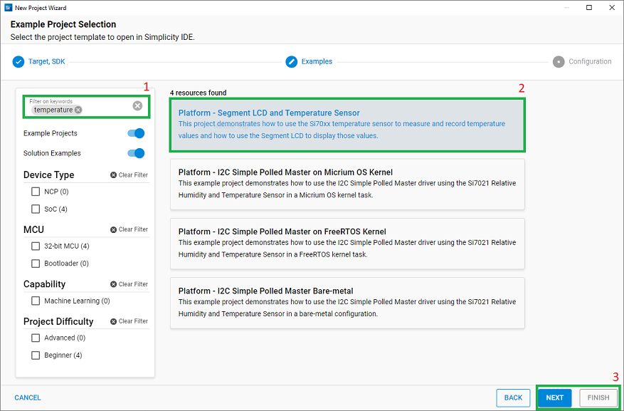

# Platform - Segment LCD and Temperature Sensor ##

## Summary ##
This project demonstrates how to use the Si70xx (BRD2600A, BRD2504A, and BRD2506A) or SHT4x (BRD2505A) temperature sensor to measure and record temperature values and how to use the Segment LCD to display those values.

## SDK version ##

- SiSDK v2024.12.2

## Hardware Required ##

* Board:  [Silicon Labs EFR32FG23 Dev Kit Board (BRD2600A)](https://www.silabs.com/development-tools/wireless/proprietary/efr32fg23-868-915-mhz-14-dbm-dev-kit?tab=overview) 
* Board:  [Silicon Labs EFM32PG23 Pro Kit Board (BRD2504A)](https://www.silabs.com/development-tools/mcu/32-bit/efm32pg23-pro-kit?tab=overview) 
* Board:  [Silicon Labs EFM32PG26 Pro Kit Board (BRD2506A)](https://www.silabs.com/development-tools/mcu/32-bit/efm32pg26-pro-kit?tab=overview)	
* Board:  [Silicon Labs EFM32PG28 Pro Kit Board (BRD2506A)](https://www.silabs.com/development-tools/mcu/32-bit/efm32pg28-pro-kit?tab=overview)

## Connections Required ##
Connect the board via a micro-USB or USB-C cable to your PC to flash the example.

## Setup ##
You can either create a project based on an example project or start with an empty example project.

### Create a project based on an example project ##

1. From the Launcher Home, add the BRD2600A, BRD2504A, BRD2505A, or BRD2506A to My Products, click on it, and click on the **EXAMPLE PROJECTS & DEMOS** tab. Find the example project with the filter "temperature".

2. Click **Create** button on the **Platform - Segment LCD and Temperature Sensor** example. Example project creation dialog pops up -> click Create and Finish and Project should be generated.

3. Build and flash this example to the board.

### Start with an "Empty C Project" project ##

1. Create an **Empty C Project** project for your hardware using Simplicity Studio 5.

2. Copy the attached src/app.c file into your project (overwriting existing).

3. Open the .slcp file. Select the SOFTWARE COMPONENTS tab and install the software components:

   - [Platform] → [Board Drivers] → [Segment LCD]
   - [Platform] → [Board Drivers] → [Si70xx - Temperature/Humidity Sensor] (BRD2600A, BRD2503A or BRD2506A)
   - [Platform] → [Board Drivers] → [SHT4x - Temperature/Humidity Sensor] (BRD2505A)
   - [Services] → [Timers] → [Sleep Timer]
   
4. Build and flash the project to your device.

**Note**:
- If the user using brd2505a or brd2506a the SL_BOARD_ENABLE_SENSOR_RHT macro should be enabled by the step below:
   [Platform] → [Board] → [Starter Kit] → [Board Control] → turn on "Enable Relative Humidity and Temperature sensor"

- Make sure that this repository is added to [Preferences > Simplicity Studio > External Repos](https://docs.silabs.com/simplicity-studio-5-users-guide/latest/ss-5-users-guide-about-the-launcher/welcome-and-device-tabs).

## How It Works ##
The project uses a periodic sleeptimer that executes a callback function every 5 seconds. This callback function calls APIs from the relative humidity and temperature sensor driver library to measure and read the temperature and relative humidity values from the sensor. These values are then displayed on the segment LCD using APIs from the Segment LCD driver library.

## Note ##
Although measures have been taken to isolate the temperature sensor from the board, temperature measurement results will be affected by on-board power dissipation. More accurate temperature measurements are obtained when powering the board with a battery or through the Mini Simplicity connector and on-board debugger in a low power state.
