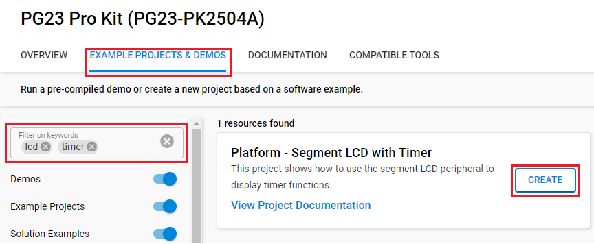

# Platform - Segment LCD with Timer #

## Overview ##

This project shows how to use the segment LCD peripheral on two different xG23 boards, PG26, and PG28 pro kit to display timer functions.

## SDK version ##

- SiSDK v2024.12.2

## Hardware Required ##

* Board:  [Silicon Labs EFR32FG23 Dev Kit Board (BRD2600A)](https://www.silabs.com/development-tools/wireless/proprietary/efr32fg23-868-915-mhz-14-dbm-dev-kit?tab=overview) 
* Board:  [Silicon Labs EFM32PG23 Pro Kit Board (BRD2504A)](https://www.silabs.com/development-tools/mcu/32-bit/efm32pg23-pro-kit?tab=overview) 
* Board:  [Silicon Labs EFM32PG26 Pro Kit Board (BRD2506A)](https://www.silabs.com/development-tools/mcu/32-bit/efm32pg26-pro-kit?tab=overview)	
* Board:  [Silicon Labs EFM32PG28 Pro Kit Board (BRD2506A)](https://www.silabs.com/development-tools/mcu/32-bit/efm32pg28-pro-kit?tab=overview)

## Connections Required ##

- Connect the board via a micro-USB cable to your PC to flash the example.

## Setup ##

To test this application, you can either create a project based on an example project or start with an empty example project.

### Create a project based on an example project ### 

1. Make sure that this repository is added to [Preferences > Simplicity Studio > External Repos](https://docs.silabs.com/simplicity-studio-5-users-guide/latest/ss-5-users-guide-about-the-launcher/welcome-and-device-tabs).

2. From the Launcher Home, add the board to My Products, click on it, and click on the **EXAMPLE PROJECTS & DEMOS** tab. Find the example project filtering by **lcd** and **timer**.

3. Click the **Create** button on the **Platform - Segment LCD with Timer** example. Example project creation dialog pops up -> click **Finish** and Project should be generated.

    

4. Build and flash this example to the board.

### Start with an empty example project ###

1. Create an **Empty C Project** project for your hardware using Simplicity Studio 5.

2. Replace the `app.c` file in the project root folder with the provided `app.c` (located in the src folder).

3. Open the .slcp file. Select the SOFTWARE COMPONENTS tab and install the software components:

    - [Platform] → [Board Drivers] → [Segment LCD]
    - [Platform] → [Peripheral] → [LETIMER]

4. Build and flash the project to your device.

## How It Works ##

At first, the segment LCD displays 00000. Press Push Button 0 to start the timer.

The push buttons also have the following functionalities:
Regular timer mode (default mode):

1. Push Button 0 -> start/stop the timer
2. Push Button 1 single click -> reset the timer

To configure the Compare mode:

1. Push Button 1 hold for 2 or more seconds -> enter compare mode
2. Push Button 0 -> configure the value of the timer to trigger compare match
3. Push Button 1 -> exit compare mode setup
4. Push Button 0 -> start timer and run the compare mode
5. When compare match happens, the Segment LCD will blink with the current value
6. Press Button 0 or 1 to exit compare mode when compare match happens

The segment LCD needs to be configured to display numerical values correctly on the selected board. This is taken care of by the LCD driver library. The LETIMER is configured to interrupt every 1 Hz and update the segment LCD accordingly. The GPIOs for the push buttons are configured as inputs and will interrupt once pressed to perform specific operations.
