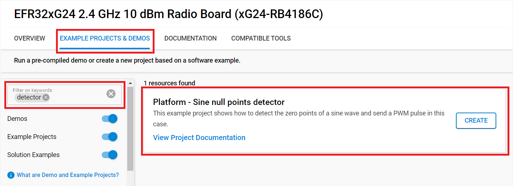

# Platform - Sine null points detector #

## Overview ##

The Sine Null Detector is a software application designed to identify the points when a sine wave signal crosses the zero voltage level during its oscillation cycle. (When the sine wave equals n * 180° in phase - n being an integer)

The program works by monitoring an incoming sine wave signal, which is a continuous oscillation that alternates between positive and negative values. When the sine passes from positive to negative (or vice versa), it crosses the zero axis. The program detects these zero crossings by evaluating the polarity change in the signal data, triggering an event each time the wave crosses zero and sending out a PWM signal. The duty cycle of the PWM is configurable via the buttons (BTN0 and BTN1). The detector function is implemented with PRS, therefore the MCU is continuously in EM2 mode. 

The example is workoing with 50Hz, 3.3 Vpp and 1.65 Voffset sine wave.

## Gecko SDK version ##

- GSDK v4.4.4

## Simplicity SDK version ##

- SiSDK v2024.6.1

## Hardware Required ##

- [EFR32xG24 Wireless 2.4 GHz +10 dBm Radio Board](https://www.silabs.com/development-tools/wireless/xg24-rb4186c-efr32xg24-wireless-gecko-radio-board?tab=overview)

- Wireless Starter Kit (WSTK) Mainboard (SLWMB4002A, formerly BRD4002A)

## Connections Required ##

Connect the board via the connector cable to your PC to flash the example.

## Setup ##

To test this application, you can either create a project based on an example project or start with an "Empty C Project" project based on your hardware.

### Create a project based on an example project ###

1. Make sure that this repository is added to [Preferences > Simplicity Studio > External Repos](https://docs.silabs.com/simplicity-studio-5-users-guide/latest/ss-5-users-guide-about-the-launcher/welcome-and-device-tabs).

2. From the Launcher Home, add your product name to My Products, click on it, and click on the **EXAMPLE PROJECTS & DEMOS** tab. Find the example project filtering by "detector".

3. Click the **Create** button on **Platform - Sine null point detector** example. Example project creation dialog pops up -> click Create and Finish and the project should be generated.

4. Build and flash this example to the board.

### Start with an "Empty C Project" project ###

1. Create an **Empty C Project** project for your hardware using Simplicity Studio 5.

2. Copy all files in the `inc` and `src` folders into the project root folder (overwriting the existing file).

3. Install the software components:

    3.1. Open the .slcp file in the project

    3.2. Select the SOFTWARE COMPONENTS tab

    3.3. Install the following components:

    - [Platform] → [Peripheral] → [ACMP]
    
    - [Platform] → [Peripheral] → [PRS]

    - [Platform] → [Peripheral] → [LETIMER]

    - [Services] → [Power Manager] → [Power Manager]

    - [Services] → [Clock Manager] → [Clock Manager]

    - [Services] → [IO Stream] → [Driver] → [IO Stream: EUSART]

    - [Application] → [Utility] → [Log]

4. Install two instances of this component:

    - [Platform] → [Driver] → [Simple Button]

5. Enable Virtual COM UART

    - [Platform] → [Board] → [Board Control] → [Configure] → [Enable Virtual COM UART]

6. Build and flash the project to your board.

## How It Works ##

The example uses two ACMPs to detect a sine wave's null points. If a null point is detected then a PWM signal is sent out on a GPIO pin.

After flashing the project to the board, the board waits for a 50Hz, 3.3 V Vpp and +1.65 Voffset sine wave signal on its two ACMP inputs. The MCU will sleep in EM2 mode during this time. The two ACMP reference voltages are 1.65 V which comes from the 2.5 V internal voltage reference. The internal voltage is split to give the correct reference voltage for the ACMPs. In the case of null point detection, you need to use 2 ACMPs. One of the ACMPs receive the signal on the positive input and the other one receives the signal on its negative input. In the case, when the signal is equal to the reference voltage, the outputs of the ACMPs are equal for a short time. For the detection of this interval the program uses a PRS XNOR logic.

The two ACMP outputs are connected to the PRS as producers. The two signals, which is sent on PRS by ACMP, will be XNOR together by PRS logic and this signal will give an impulse of null points of sine which will generate the PWM impulse. The PWM is cleared by the rising edge of the XNOR PRS signal and is started by the falling edge of the XNOR PRS signal.

The PWM pulse is generated by the LETIMER because this timer is able to operate in low energy modes (such as EM2/3). The duty cycle of the PWM is configurable using the buttons on the WSTK, where the BTN0 will increase and the BTN1 will decrease this value. The default duty cycle value is set to 100%.

A debug mode is also provided for testing the program (disabled by default), where the user can check the PRS signal on the output pins. In order to enable it, change the DEBUG_MODE_ENABLE macro to 1.

The pinout table can be found here, where the pin outputs which are enabled by the debug mode are also highlighted.

### Pin Routing ###
| Pin Name | DEBUG MODE | BRD4186C | 
| --- | --- | --- |
| ACMP0 INPUT |  | EXP7, P2 (PA5) |
| ACMP0 OUTPUT | X | EXP10, P7 (PC0) |
| ACMP1 INPUT | | P17, F12 (PB1) |
| ACMP1 OUTPUT | X | EXP13, P10 (PA7) |
| NULL POINT DETECTOR OUTPUT | X | EXP11, P8 (PA6) |
| PWM OUTPUT |  | P19, F10 (PB2) |