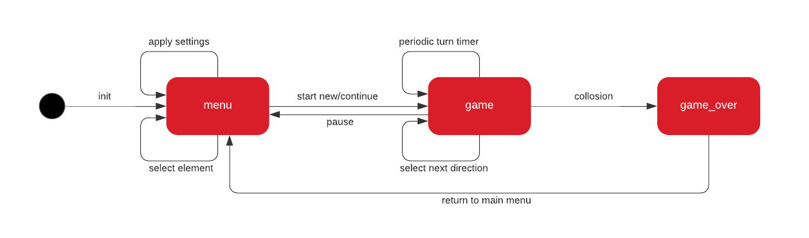
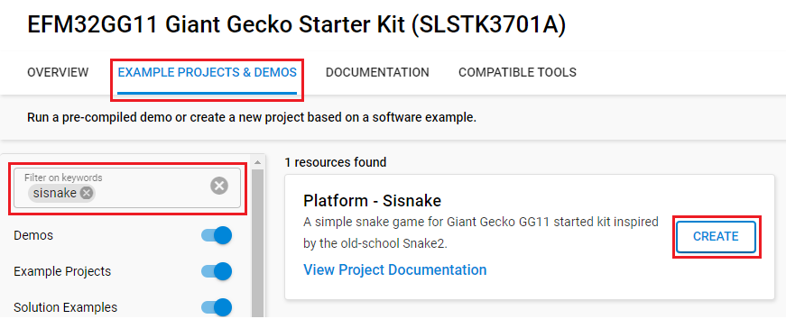

# Platform - Sisnake #

## Overview ##

A simple snake game for Giant Gecko GG11 started kit inspired by the old-school Snake 2. There is a snake controlled by the player with btn0(left) and btn1(right). The goal is to make as many points as possible, by eating food randomly spawn at the game field. The snake will be longer with every piece of food it eats. The game is over when the head of the snake collides with a wall, or with its own body. The main logic of the app is achieved with a state machine driven by interrupts.

## Gecko SDK version ##

- GSDK v4.4.3

## Hardware Required ##

- [SLSTK3701A Giant Gecko GG11 Starter Kit](https://www.silabs.com/development-tools/mcu/32-bit/efm32gg11-starter-kit?tab=overview)

## Connections Required ##

Connect the Giant Gecko GG11 Starter Kit via a micro-USB cable to your PC.

## Setup ##

To test this application, you can either create a project based on an example project or start with an empty example project.

### Create a project based on an example project ###

1. Make sure that this repository is added to [Preferences > Simplicity Studio > External Repos](https://docs.silabs.com/simplicity-studio-5-users-guide/latest/ss-5-users-guide-about-the-launcher/welcome-and-device-tabs).

2. From the Launcher Home, add the BRD2204A to My Products, click on it, and click on the **EXAMPLE PROJECTS & DEMOS** tab. Find the example project filtering by **sisnake**.

3. Click the **Create** button on the **Platform - Sisnake** example. Example project creation dialog pops up -> click **Finish** and Project should be generated.

    

4. Build and flash this example to the board.

### Start with an empty example project ###

1. Create an **Empty C Project** project for your hardware using Simplicity Studio 5.

2. Copy all related files in 'src' folder into the project and replace the existing files.

3. Open the .slcp file. Select the SOFTWARE COMPONENTS tab and install the software components:

    - [Platform] → [Board Drivers] → [Memory LCD] → [Display Driver] → [Color Sharp Memory LCD]
    - [Platform] → [Board Drivers] → [Memory LCD] → [Peripheral Driver] → [Memory LCD with usart SPI driver]
    - [Platform] → [Driver] → [GLIB Graphics Library]
    - [Platform] → [Driver] → [GLIB driver for Memory LCD]
    - [Platform] → [Driver] → [Button] → [Simple Button] → default instance name: btn0, btn1
    - [Platform] → [Peripheral] → [CSEN]
    - [Platform] → [Security] → [Mbed TLS] → [Randomness] → [CTR-DRBG]
    - [Platform] → [Utilities] → [String Functions]

4. Build and flash the project to your device.

## How It Works ##

After flashing the binary, you will be able to see the main menu of the game. Use the buttons to move up and down, and touch the slider to select your option. Press **button 0** and ** button 1 to control the snake to eat the food. Your score is displayed at the top right corner of the LCD screen.

