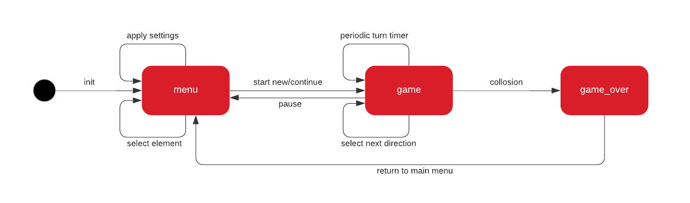

# Sisnake #
A snake game for Giant Gecko GG11 started kit.

## Summary ##
A simple snake game for Giant Gecko GG11 started kit inspired by the old-school Snake2. There is a snake controlled by the player with btn0(left) and btn1(right). The goal is to make as many points as possible, by eating food randomly spawn at the game field. The snake will be longer with every piece of food it eats. The game is over when the head of the snake collides with a wall, or with its own body.
The main logic of the app is achieved with a state machine driven by interrupts.

  

Figure 1. App state machine

## Gecko SDK version ##

v3.1

## Hardware Required ##

* One Starter Kit (SLTK3701A) Mainboard, BRD2204A

## Setup ##

Import the included .sls file to Simplicity Studio then build and flash the project to the SLSTK3701A.

## .sls Projects Used ##

sisnake.sls

## How to Port to Another Part ##

Open the "Project Properties" and navigate to the "C/C++ Build -> Board/Part/SDK" item.
Select the new board or part to target and "Apply" the changes.

**_Note_**_: there may be dependencies that need to be resolved when changing the target architecture. The current version works only with 128x128 3bit display._
&nbsp;
##### _Have fun!_ #####