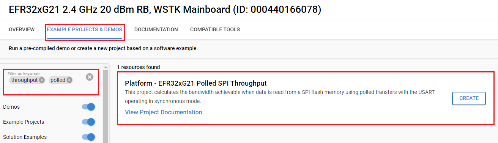

# xG21 Polled SPI Throughput Tester #

## Overview ##

This project calculates the bandwidth achievable when data is read from the SPI flash memory using polled transfers with the USART operating in synchronous mode.

Because this code benchmarks read performance, there is no need to connect an actual SPI flash device to the EFR32xG21 board. The timing of read operations is gated by the timing achievable with the USART and the GPIO pins that would otherwise interface to such a device. These pins are driven as they would be if connected to an actual IC and can be observed on an oscilloscope.

Modules used: CMU, EMU, GPIO, Sleep Timer, USART0 (for VCOM), and USART2 (SPI flash).
## Gecko SDK Suite version ##

- GSDK v4.4.3

## Hardware Required ##

- [EFR32xG21 Wireless Gecko Starter Kit (BRD4180A)](https://www.silabs.com/development-tools/wireless/efr32xg21-wireless-starter-kit?tab=overview)

## Connections Required ##

Connect the board via the connector cable to your PC to flash the example.

## Setup ##

To test this application, you can either create a project based on an example project or start with an "Empty C Project" project based on your hardware.

### Create a project based on an example project ###

1. Make sure that this repository is added to [Preferences > Simplicity Studio > External Repos](https://docs.silabs.com/simplicity-studio-5-users-guide/latest/ss-5-users-guide-about-the-launcher/welcome-and-device-tabs).

2. From the Launcher Home, add your product name to My Products, click on it, and click on the **EXAMPLE PROJECTS & DEMOS** tab. Find the example project filtering by "throughput" and "polled".

3. Click the **Create** button on **Platform - EFR32xG21 Polled SPI Throughput** example. Example project creation dialog pops up -> click Create and Finish and the project should be generated.

4. Build and flash this example to the board.

### Start with an empty example project ###

1. Create an "Empty C Project" for the "BRD4180A" board using Simplicity Studio v5. Use the default project settings.

2. Copy the `app.c` file in the `src` folder to the project root folder (overwriting the existing file).

3. Install the software components:

    - Open the .slcp file in the project.

    - Select the SOFTWARE COMPONENTS tab.

    - Install the following components:

        - [Services] → [IO Stream] → [IO Stream: USART]: use default instance: vcom
  
        - [Application] → Utility] → [Log]

        - [Services] → [Timers] → [Sleep Timer]
  
        - [Services] → [Device Initialization] → [Peripherals] → [Digital Phase-Locked Loop (DPLL)]: use default configuration or configure other clock frequencies as following picture
        

        - [Platform] → [Board] → [Board Control]: enable **Enable Virtual COM UART** as below:
              

4. Build and flash this example to the board.

## How It Works ##

This code provides a reasonable configuration. It is a simple matter to change the amount of data read or, in particular, the frequency of the USART module clock. The Digital Phase-Locked Loop (DPLL) is used to generate the system clock (SYSCLK). SYSCLK is the top-level clock from which the bus clock (HCLK) and the synchronous peripheral clock (PCLK) are derived. The initialization structures are present in the code (all but one of which is commented out) to set the DPLL output to 40, 50, and 40 MHz. The PCLK frequency is one of 40, 50, and 40 MHz respectively.

After sending the SPI flash read command and the 24-bit address. Then 1 Mbyte of dummy data is clocked out of the TX pin, which the SPI flash would ignore. Meanwhile, 1 Mbyte of data is clocked in on the RX pin in blocks of 1 Kbyte at a time. The sleep timer is started and stopped immediately before and after the read sequence. The difference between the start and end times is used to calculate bandwidth.

The application flow is described as follows:

1.  USART2 is initialized for operation in synchronous mode (SPI).

    - The divider is set for the maximum possible clock frequency (PCLK / 2). The USART is set to transfer and receive data MSB first. This is the standard for SPI devices and what any M25P40-compatible flash expects. The clock phase (CLKPHA) and clock polarity (CLKPOL) are both set to 0, which is often called SPI mode 0. 

    - Because the delays through the EFR32 GPIO multiplexing logic are relatively long. Hence, it is necessary to enable synchronous master sample delay (USART_CTRL_SMSDELAY), which results in input data being sampled on the subsequent clock edge. In SPI mode 0, input data is sampled not on the falling edge of the clock but on the next rising edge of the clock. This is perfectly allowable and expected. Because any modern SPI flash device is going to support clock rates well in excess (100 MHz is not unusual) of the maximum 50 MHz. These frequencies are supported by the original M25P40.
    The slave device will not change the transmitted data until this edge is received. At which point the master will have already latched it.

2. The start time is synchronized (saved as soon as the sleep timer counter is incremented). The sleep timer is started to increase the counter every millisecond.

3. The read sequence is started by sending the READ command and the 24-bit flash address.

4. A for-loop transmits a dummy byte the specified number of times and reads the data. Data would have been clocked in from the receive data register. This code could be made interrupt-driven, although only minimal additional bandwidth would be available (receiving a byte takes 320 ns at 40 MHz. The Cortex-M33 interrupt latency is the same 16 clocks as the Cortex-M4. Hence, entering the USART transmit complete interrupt at 80 MHz would require 200 ns).

5. The sleep timer is captured and the counter is captured.

6. The data transfer rate is calculated and displayed with the USART2 clock. You can launch Console, which is integrated into Simplicity Studio or you can use a third-party terminal tool like Tera Term to receive the data. Data is coming from the UART COM port. A screenshot of the console output is shown in the figure below.
