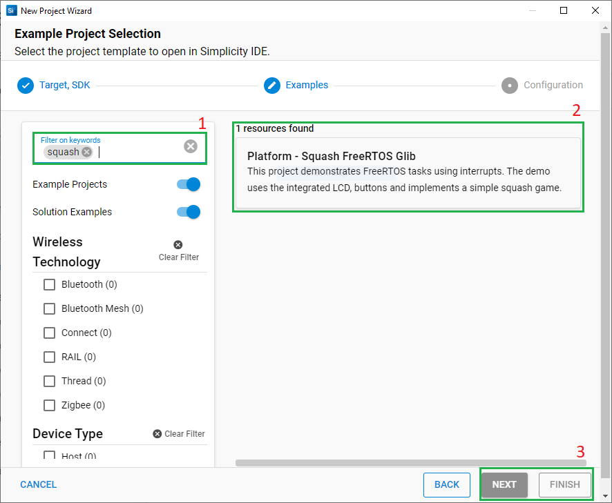

# Platform Squash FreeRTOS Glib #

## Summary
This demo application demonstrates FreeRTOS tasks using interrupts. The demo uses the integrated LCD, and buttons and implements a simple squash game. Buttons are used to move the racket up and down. Button0 moves down while button1 moves up the racket.

## Gecko SDK Version
v4.4.3

## Hardware Required
* Board:  [EFR32xG22 Wireless Gecko Starter Kit](https://www.silabs.com/development-tools/wireless/efr32xg22-wireless-starter-kit?tab=overview) 
* Board:  [EFR32MG12 2.4 GHz 10 dBm Radio Board](https://www.silabs.com/development-tools/wireless/zigbee/slwrb4162a-efr32mg12-radio-board?tab=overview) 

## Connections Required 
Connect the board via a micro-USB or USB-C cable to your PC to flash the example.

## Setup
You can either create a project based on an example project or start with an empty example project.

### Create a project based on an example project

1. From the Launcher Home, add the BRD4162A to My Products, click on it, and click on the **EXAMPLE PROJECTS & DEMOS** tab. Find the example project with the filter "squash".

2. Click **Create** button on the **Platform - Squash FreeRTOS Glib** example. Example project creation dialog pops up -> click Create and Finish and Project should be generated.

3. Build and flash this example to the board.

### Start with an "Empty C Project" project

1. Create an **Empty C Project** project for your hardware using Simplicity Studio 5.

2. Copy the attached "src/app.c" and "config/brd4162a/squash_config.h" files into your project (overwriting existing).

3. Open the .slcp file. Select the SOFTWARE COMPONENTS tab and install the software components:

   - [Platform] → [Board] → [Radio Board] → [Board Control]→ Enable Display
   - [Platform] → [Drivers] → [GLIB Graphics Library]
   - [Platform] → [Drivers] → [GPIOINT]
   - [RTOS] → [FreeRTOS Heap 4]
   - [Platform] → [Driver] → [LED] → [Simple LED] → led0 instance
   
4. Build and flash the project to your device.

**Note:**

- Make sure that this repository is added to [Preferences > Simplicity Studio > External Repos](https://docs.silabs.com/simplicity-studio-5-users-guide/latest/ss-5-users-guide-about-the-launcher/welcome-and-device-tabs).

## How It Works
  
The main program contains three tasks to control the game and an additional fourth task can be configured to blink the LED0. Each press on any of the buttons triggers an interrupt that sends a semaphore to the associated task. Tasks are blocked on the semaphores, GPIO IRQ handlers send the semaphore that unblocks the tasks ( vRacket_down, vRacket_up ) that perform moving operation of the racket. The vBall function moves the ball.
