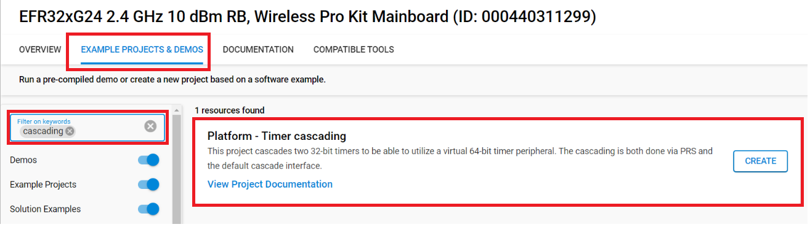

# Platform - Timer cascading #

## Overview ##

This project cascades two timers (TIMER0 and TIMER1) to be able to utilize a virtual timer peripheral, that has a bigger precision due to the extended bit size. The cascading is implemented in two different ways via PRS and the default linked conenction interface.

## Gecko SDK version ##

- GSDK v4.4.3

## Hardware Required ##

- [EFR32xG24 Wireless 2.4 GHz +10 dBm Radio Board](https://www.silabs.com/development-tools/wireless/xg24-rb4186c-efr32xg24-wireless-gecko-radio-board?tab=overview)

- Wireless Starter Kit (WSTK) Mainboard (SLWMB4002A, formerly BRD4002A)

**Note:**

   - Tested boards for working with this example:

      | Board ID | Description  |
      | ---------------------- | ------ |
      | BRD4181c | [EFR32xG21B Wireless Gecko 2.4 GHz +10 dBm Radio Board with Secure Vault](https://www.silabs.com/development-tools/wireless/slwrb4181c-efr32xg21-wireless-gecko-radio-board?tab=overview)|
      | BRD4182a | [EFR32xG22 Wireless Gecko 2.4 GHz +6 dBm 5x5, QFN40 Radio Board](https://www.silabs.com/development-tools/wireless/slwrb4182a-efr32xg22-wireless-gecko-radio-board?tab=overview)|
      | BRD4210a | [EFR32XG23 868-915 MHz +20 dBm Radio Board](https://www.silabs.com/development-tools/wireless/xg23-rb4210a-efr32xg23-868-915-mhz-20-dbm-radio-board?tab=overview)|
      | BRD4186c | [EFR32xG24 Wireless 2.4 GHz +10 dBm Radio Board](https://www.silabs.com/development-tools/wireless/xg24-rb4186c-efr32xg24-wireless-gecko-radio-board?tab=overview)|
      | BRD4270b | [EFR32FG25 902-928 MHz +16 dBm Radio Board](https://www.silabs.com/development-tools/wireless/proprietary/fg25-rb4270b-efr32fg25-radio-board?tab=overview)|
      | BRD4194a | [EFR32xG27 Wireless 2.4 GHz +8 dBm Radio Board](https://www.silabs.com/development-tools/wireless/xg27-rb4194a-efr32xg27-8-dbm-wireless-radio-board?tab=overview)|
      | BRD4400c | [EFR32xG28 2.4 GHz BLE and +14 dBm Radio Board](https://www.silabs.com/development-tools/wireless/xg28-rb4400c-efr32xg28-2-4-ghz-ble-and-14-dbm-radio-board?tab=overview)|

## Connections Required ##

Connect the board via the connector cable to your PC to flash the example.

## Setup ##

To test this application, you can either create a project based on an example project or start with an "Empty C Project" project based on your hardware.

### Create a project based on an example project ###

1. Make sure that this repository is added to [Preferences > Simplicity Studio > External Repos](https://docs.silabs.com/simplicity-studio-5-users-guide/latest/ss-5-users-guide-about-the-launcher/welcome-and-device-tabs).

2. From the Launcher Home, add your product name to My Products, click on it, and click on the **EXAMPLE PROJECTS & DEMOS** tab. Find the example project filtering by "cascading".

3. Click the **Create** button on **Platform - Timer cascading** example. Example project creation dialog pops up -> click Create and Finish and the project should be generated.

4. Build and flash this example to the board.

### Start with an "Empty C Project" project ###

1. Create an **Empty C Project** project for your hardware using Simplicity Studio 5.

2. Copy all files in the `inc` and `src` folders into the project root folder (overwriting the existing file).

3. Install the software components:

    3.1. Open the .slcp file in the project

    3.2. Select the SOFTWARE COMPONENTS tab

    3.3. Install the following components:

    - [Platform] → [Peripheral] → [GPIO]
    
    - [Platform] → [Peripheral] → [PRS]

    - [Platform] → [Peripheral] → [TIMER]

4. Build and flash the project to your board.

## How It Works ##

The example uses two timers (TIMER0 and TIMER1), that are available on all of the Series 2 device MCUs. TIMER0 is a 32-bit generic timer with 3 compare/capture channels, whereas TIMER1 can be both 32-bit and 16-bit long depending on the selected device, thus the maximum precision reachable by the application is 64-bit or 48-bit respectively.
 
The application defines the `PRS_MODE` macro to switch between the default timer connection interface and the PRS peripheral to connect the two timers together.

When the timer connection interface is used (`PRS_MODE = 0`), the timers are only allowed to count on overflow/underflow events from the lower numbered neighbouring timers to create a larger timer. This also means, that all timers must be set to count the same direction and less
significant timer(s) can only be set to count up or down.

When PRS is used (`PRS_MODE = 1`), there are no constraints on which timer instances can be used with one another.

A specific output frequency can be on TIMER0 via the `TIMER0_OUT_FREQ` macro, which makes it easier to test the connection between the peripherals, whereas `TIMER1_TOP` sets the top value of the second timer. By default, both timers' output are routed to LED0 and LED1 respectively and a frequency of 1Hz is set for TIMER0, which is then devided by setting `TIMER1_TOP`.

The theoretical maximum precision achievable by the cascaded timers are defined by the bit count of each timer and the top values' configurations. If two 32-bit timers are used and the top values are set to the highest possible number (**0xFFFFFFFF**) then the combined precision on TIMER1's output reaches 64-bits.
