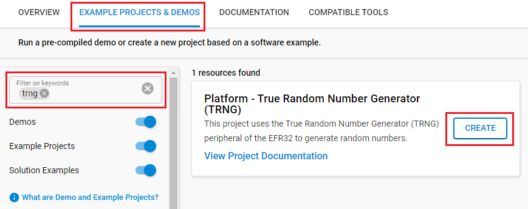

# Platform - True Random Number Generator (TRNG) #


## Overview ##

This project uses the True Random Number Generator (TRNG) peripheral of the EFM32GG11 to generate random numbers.

## Peripherals Used ##

- TRNG
- USART

> It is highly recommended to use the [software libraries](https://docs.silabs.com/mbed-tls/latest/group-rng-module) provided by Silicon Labs to access the TRNG module. This example should serve as a reference for users that choose to write their own low-level drivers.

## SDK version ##

- GSDK v4.4.3

## Hardware Required ##

- [One SLSTK3701A Giant Gecko GG11 Starter Kit](https://www.silabs.com/products/development-tools/mcu/32-bit/efm32-giant-gecko-gg11-starter-kit)

## Connections Required ##

- Connect the board via a USB cable to your PC to flash the example.

## Setup ##

To test this application, you can either create a project based on an example project or start with an "Empty C Project" project based on your hardware.

### Create a project based on an example project ###

1. Make sure that this repository is added to [Preferences > Simplicity Studio > External Repos](https://docs.silabs.com/simplicity-studio-5-users-guide/latest/ss-5-users-guide-about-the-launcher/welcome-and-device-tabs).

2. From the Launcher Home, add the BRD2204A to My Products, click on it, and click on the **EXAMPLE PROJECTS & DEMOS** tab. Find the example project filtering by "trng".

3. Click the **Create** button on the **Platform - True Random Number Generator (TRNG)** example. Example project creation dialog pops up -> click Create and Finish and Project should be generated.


4. Build and flash this example to the board.

### Start with an "Empty C Project" project ###

1. Create an **Empty C Project** project for your hardware using Simplicity Studio 5.

2. Replace the `app.c` file in the project root folder with the provided `app.c` (located in the src folder).

3. Open the .slcp file. Select the SOFTWARE COMPONENTS tab and install the software components:

     - [Services] → [IO Stream] → [IO Stream: EUSART] → default instance name: vcom
     - [Services] → [IO Stream] → [IO Stream: Retarget STDIO]
     - [Platform] → [Board] → [Board Control] → enable *Virtual COM UART*
     - [Platform] → [Utilities] → [Microsecond Delay]
     - [Third Party] → [Tiny printf]

4. Build and flash the project to your device.

## How It Works ##

On startup, a Conditioning Function test and Entropy Source Check are conducted.

```log
bare-metal TRNG example using ADC as entropy source

====================================================
Known-Answer Test for Conditioning Function
====================================================

Key               0x2B7E151628AED2A6ABF7158809CF4F3C

Input             0x6BC0BCE12A459991E134741A7F9E1925
                  0xAE2D8A571E03AC9C9EB76FAC45AF8E51
                  0x30C81C46A35CE411E5FBC1191A0A52EF
                  0xF69F2445DF4F9B17AD2B417BE66C3710

Expected Output   0x3FF1CAA1681FAC09120ECA307586E1A7
Received Output   0x3FF1CAA1681FAC09120ECA307586E1A7
====================================================
TRNG Condition Function Check -> PASSED

====================================================
Entropy Source Checking using repetition, 64-sample,
and 4096-sample
====================================================
Dumping test data:
 0xB6960D77  0x5D9BF496  0x048EC145  0x01C82CC8 
 0xEEB8E0FF  0x18BD73BC  0x16901253  0xF51C0905 
 0x79D2844B  0x0A1DD757  0x59E5BD06  0xE98B0730 
 0xF4EB52B8  0xFF1DAD44  0xDADD4D88  0x135BE3B7 
 0x0516FF56  0x353D5D97  0xEA043EBD  0xE5D4F268 
 0xE50DAA76  0x8826A421  0xE85DCDA2  0x7942167D 
 0x39945277  0x5BCE4BFD  0xEA001096  0x016C9388 
 0x3E41D0C5  0xB3B08E2A  0x3918BA78  0xF19CFFAB 
 0x9684C813  0x0B6D6AD6  0xD4E37859  0xDA86A1C9 
 0x4AD6B62D  0x7FEC1C04  0x897866D7  0x4CB35100 
 0x4E9C0548  0x02357383  0xB385B85F  0x13D2F5FA 
 0x8C5D6450  0x0CF27566  0x861CAEF0  0x243453E1 
 0x929710BB  0x3AE9BDF2  0x8ED24EF7  0xBE692833 
 0x3F6898E9  0x6FFB133B  0x4F8CBDE2  0x507BE9F8 
 0xE688A7C0  0xF0DED0BB  0xECCF6F7B  0xAACF370E 
 0x1CED7BE3  0x83D9EE3B  0x3E407800  0xDCF8F1D2 
 0x1BC04B83  0x85E31EF0  0x5DE62706  0x052FAAF5 
 0xB4303A12  0x8AC0C61A  0x0BD521E1  0xB31E68CF 
 0xA3B803B2  0x0DE474E9  0x74A31F2A  0xA5323C75 
 0xBCA48E66  0xEC27C602  0xE0613193  0xE9127967 
 0xC7F35D23  0x96123903  0x81481C5F  0xD173E5BE 
 0x9B63776D  0x669B986E  0xA60F0FC2  0x2779D420 
 0x0A55B175  0x566CD476  0x8C550D57  0x8E10E2F8 
 0x030AA5E7  0xE13F6169  0x781CA37E  0x336CBFF6 
 0x39F3A171  0xADA5B874  0x5B12DF9E  0x1D9DCFDA 
 0x33DB615B  0xC00956DC  0xE6AB555F  0xBEBC0100 
 0x2C823F2E  0x1B304E0C  0x6197756A  0xD67E0F90 
 0xA6DE0239  0x87F8C642  0xAF5E0297  0xBBC68D97 
 0x4D4C82B2  0x54D9D471  0x04A0E416  0x285A80CA 
 0x8C32AB3B  0xEE4E09CC  0xA5C81E8D  0x1E290CB3 
 0x50BF9F0B  0xC1FD1E3E  0x67644322  0x09049AD1 
 0x2BF2E809  0xB95F454D  0x72E5849F  0xFD726084 
 0xDF4A36C2  0xE162A436  0x21AEACC3  0x0F079389 
 0xB5F67D63  0x6786C021  0x20B591EF  0x7808ACD3 
 0x5F650C71  0x28D5F141  0x1D2C2C23  0x00C649E2 
 0x40205A31  0x2FB3A687  0x92C866DE  0x8A1A4545 
 0x0B464638  0x523CA533  0xF6437090  0x1B4B0E9C 
 0x670A4853  0x4414ED76  0x97CDF4A4  0x62611291 
 0x6321A2BF  0xFAC00EF5  0x899B6832  0xCEAF04A1 
 0xFB62C20F  0x77A3DB5D  0xC5C67EF1  0xCA570755 
 0xE7B5DDB1  0x6AAED50E  0xBBD1DC02  0x0768BE24 
 0xA1821D6E  0xC0150A74  0xF5EB5597  0x4F7892A5 
 0x0747245E  0x0FDD9A90  0x92A971DD  0x8FF281FE 
 0x3B11FB34  0xA83C7316  0xB1D2F1D4  0x791050A8 
 0xE15F740B  0xA7F126A8  0x29FB46D2  0x84C32A2E 
 0x308D1589  0xE58340A6  0x18F036B1  0x655568EE 
 0xCFAAC64C  0x0F00F310  0x6D88B454  0x009E0568 
 0xFD948B08  0xA5E25446  0xEE2B666C  0x6AC151F3 
 0xF4824F61  0x596E68C8  0x843E5803  0x8977F1E3 
 0x7F906D85  0x8D367428  0x82E33BD5  0x4C103C65 
 0xAD87A704  0x5926D69D  0xE064B422  0xAD29C383 
 0xCF520F21  0x5BB07691  0x8CAFD034  0xE65F813D 
 0x4A397619  0xAE7F645C  0xAD72B4BD  0xC5117AF3 
 0x40464F3E  0xC36C0C55  0x6AF9F321  0x98B78F52 
 0xBF993611  0xFEC12D3D  0xAA589BC9  0x1672DC15 
 0xD137B449  0x9A4AB804  0x15E89672  0xE8F29DCA 
 0x9B6C8F89  0xFFC039C8  0x98814CFC  0x5DDA6014 
 0x6CACE31B  0x3C3CEFA2  0xFEF9566A  0x90F12536 
 0xDE27FFDE  0xCE760452  0x3C8AEF04  0xEE7B75EF 
 0xC6FA2D2E  0x21E23F34  0x82869088  0x25885BF2 
 0x88429F6A  0xE9A25F29  0x52BEC43B  0x837BA6A4 
 0xF3DACDA5  0xE5D3A60D  0xC1F8D038  0x25DCE167 
 0x21CD0845  0xC988D3A1  0x6A5BB184  0x7D2AC559 
 0x1AE76D39  0xA0A141AB  0x55845D54  0xD50C5526 
 0xF1689540 

AIS31 Noise Alarm                       : 0x0
AIS31 Preliminary Noise Alarm           : 0x0
4096-sample Adaptive Proportion Test    : 0x0
64-sample Adaptive Proportion Test      : 0x0
Repetition Count Test                   : 0x0
====================================================
TRNG Entropy Source Check -> PASSED
```

Once initialized the TRNG will continuously fill a 64 x 32-bit FIFO with the generated values.
In the case where the FIFO is full, the TRNG will automatically stop until the FIFO has been emptied.

The samples from the entropy source are continually monitored by 4 built-in tests:

- AIS31 Noise Alarm
- Adaptive proportion test (4096-sample window)
- Adaptive proportion test (64-sample window)
- Repetition Count test

If these tests fail they trigger an interrupt which empties the TRNG FIFO and resets the peripheral.
