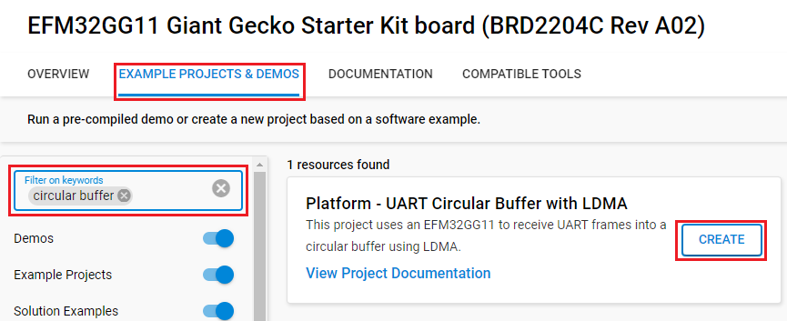
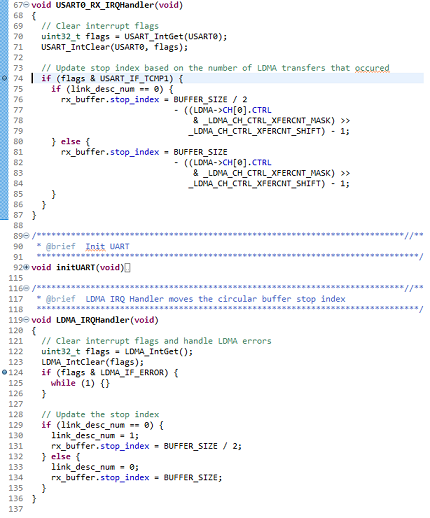

# Platform - UART Circular Buffer with LDMA #

## Overview ##

This project uses an EFM32GG11 to receive UART frames into a circular buffer using LDMA.

## Gecko SDK version ##

- GSDK v4.4.3

## Hardware Required ##

- [SLSTK3701A Giant Gecko GG11 Starter Kit](https://www.silabs.com/products/development-tools/mcu/32-bit/efm32-giant-gecko-gg11-starter-kit)
- [CP2102N-EK USBXpress Bridge Development Kit](https://www.silabs.com/development-tools/interface/cp2102n-development-kit)

## Connections Required ##

- Connect the **Giant Gecko GG11 Starter Kit** to the **CP2102N-EK USBXpress Bridge Development Kit** via a micro-USB cable to your PC.
- Connect the GG11 STK's PC1 pin to CP2102N-EK's TXD pin.

## Setup ##

To test this application, you can either create a project based on an example project or start with an empty example project.

### Create a project based on an example project ###

1. Make sure that this repository is added to [Preferences > Simplicity Studio > External Repos](https://docs.silabs.com/simplicity-studio-5-users-guide/latest/ss-5-users-guide-about-the-launcher/welcome-and-device-tabs).

2. From the Launcher Home, add the BRD2204A to My Products, click on it, and click on the **EXAMPLE PROJECTS & DEMOS** tab. Find the example project filtering by **circular buffer**.

3. Click the **Create** button on the **Platform - UART Circular Buffer with LDMA** example. Example project creation dialog pops up -> click **Finish** and Project should be generated.

    

4. Build and flash this example to the board.

### Start with an empty example project ###

1. Create an **Empty C Project** project for your hardware using Simplicity Studio 5.

2. Replace the `app.c` file in the project root folder with the provided `app.c` (located in the src folder).

3. Open the .slcp file. Select the SOFTWARE COMPONENTS tab and install the software components:

    - [Platform] → [Peripheral] → [LDMA]
    - [Platform] → [Peripheral] → [USART]

4. Build and flash the project to your device.

## How It Works ##

The application stays in EM1 until an interrupt occurs. After typing into Tera Term, the serial data from the USB is converted by the CP2102N into a UART signal that is stored into the GG11's USART RX FIFO. The LDMA is configured to start a transfer as soon as it sees data available in the FIFO. AFter the LDMA transfers BUFFER_SIZE/2 bytes of data to the circular buffer, the LDMA triggers an interrupt. In the interrupt handler, the application updates the stop index of the circular buffer to either 0 or BUFFER_SIZE/2. Set break points in interrupt handle function and start debugging to make sure that the application works correctly.

In the case where less than BUFFER_SIZE/2 data bytes are received, the LDMA interrupt will not trigger. This presents an issue to the user: the circular buffer contains updated data, but the stop index is not updated. To fix this, the RX Timeout feature triggers an interrupt after 256 baud times if a new UART frame isn't received after a end of frame event. The interrupt handler updates the stop index according to the number of LDMA transfers that occured.
