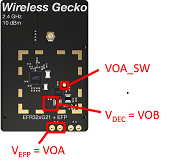

# EFR32xG21 w/ EFP01 Feature Demo #


## Summary ##

This project demonstrates use of the Silicon Labs EFP01 device,
a power management IC (PMIC) that can significantly improve
the power efficiency of a system when used in conjunction
with an EFR32 Wireless MCU. You will be working with the
EFR32xG21 2.4 GHz 10 dBm with EFP Wireless Starter Kit
(BRD4179B), which contains an EFR32xG21 device in combination
with an EFP0104.

This project allows the user to accomplish the following:

* Build and run a project that uses a default EFP01 configuration to power the 
EFR32xG21 via its DVDD and AVDD power supply pins.
* Create a new EFP01 Configurator project (using guidelines contained in 
[AN1245: EFP01 Configuration Tool Guide](https://www.silabs.com/documents/public/application-notes/an1245-efp01-configuration-tool-guide.pdf)), 
use it to generate a custom configuration, and add it to the project (optional).
* Use the EFP01 host driver API to enable EFP powering of the EFR32 DECOUPLE
pin and power rail.
* Use the EFP01 host driver and API to control the switched power supply output,
VOA_SW.

Modules used: CMU, EMU, GPIO, RMU, I2C, EFP driver.

## Gecko SDK version ##

v2.7.x

## Hardware Required ##

* Wireless Starter Kit (WSTK) Mainboard (SLWMB4001A, formerly BRD4001A)
* EFR32xG21 + EFP 2.4 GHz 20 dBm Radio Board (BRD4179B)

## Setup ##

Clone the repository with this project from GitHub onto your local machine.

From within the Simplicity Studio IDE, select Import -> MCU Project... from the 
Project menu. Click the Browse button
and navigate to the local repository folder, then to the SimplicityStudio 
folder, select the .sls file for the board,
click the Next button twice, and then click Finish.

## How the Project Works ##

This simple example contains code and configuration parameters to demonstrate 
the use of the EFP0104 device to power the EFR32xG21.  The code and 
configuration parameters are contained in three primary files:

main_xg21_efp01_feature_demo.c - This file contains the main source code, 
including main() and supporting subroutines.  The top section of the file 
(lines 39-99) contains #includes, #defines for board-specific pin assignments, 
global variables, and function prototypes for supporting subroutines.

sl_efp_instance_config_brd4179b.h - This header file is an EFP01 instance file 
and contains configiration files for the EFP01 instance that will be 
instantiated in firmware by application code using calls into the EFP01 driver.

sl_efpdrv_calc.h - This is an example of an header file that is generated by the 
EFP01 Configuration Utility in Simplicity Studio and can optionally be replaced 
by a user who regnerated this file using that utiity with desired configuration 
parameters for the EFP01.

The code flow is as follows:

1. Initialize the chip with errata-specific initializations, if appropriate.

2. Execute a GPIO trap to allow debug access by holding push button 1 during 
device reset in case the device gets into a bad state.  This is used to prevent 
bricking of the part by unintentional bug introduced in application code and is 
a good practice during all application development.

3. Initialize GPIO for WSTK push button input/ external interrupts and LED 
output.

4. Initialize EFP01 and perform EFP01 DECOUPLE handoff routine, which enables 
DCDC B output on VOB to DECOUPLE and disables the EFR32xG21 internal regulator 
via commands to the SE.

5.  The main loop checks for button presses on PB0 and PB1 and performs action 
based on global flags that are set or cleared in the ISRs for the external 
interrupts.  If PB0 is pressed, the device toggles between EM0 and EM2.  Note 
that LED0 will be ON in EM0 and OFF in EM2.  If PB1 is pressed, the code will 
toggle the EFP0104 VOA_SW output state, i.e. the VOA output will either be 
enabled or disabled.  To verify the VOA output state, measure the voltage on 
the BRD4179B VOA_SW testpoint shown below:



## .sls Projects Used ##

platform_xg21_efp01_feature_demo.sls

## Porting to Another EFR32 Device ##

This code is designed to run specifically on the BRD4179B, since this is the 
only Silicon Labs radio board with and EFR32 device paired with the EFP01.  If 
the code segments pertaining to the EFP01 are commented out, then this code 
could be ported to another device, however the usefulness of this is 
questionable since the purpose of this project is to demonstrate the EFP01 
capabilities.

For the purposes of comparing the system current consumption when using the 
EFR32xG21 with and without the EFP01, the code can easily be run on the Silicon 
Labs radio board BRD4181A, which contains the EFR32xG21 without the EFP01.  To 
do this, simply un-comment the #define at line 55 of 
main_xg21_efp01_feature_demo.c.

```
#define USINGBRD4181
```

The code can also run on EFR32xG22 and other EFR32 devices, although this has 
not been tested. In the case of these other devices, however, all peripheral or 
module clocks would need to be specifically enabled because other EFR32 families 
do not have the on-demand module clock enable
functionality that is present on xG21.

To change the target board, navigate to Project -> Properties -> C/C++ Build -> 
Board/Part/SDK. Start typing in the Boards
search box and locate the desired radio board, then click Apply to change the 
project settings, and go from there.